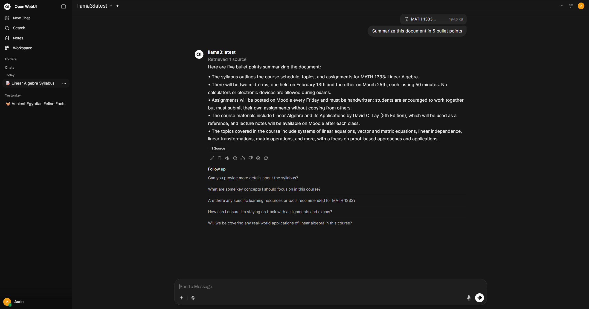
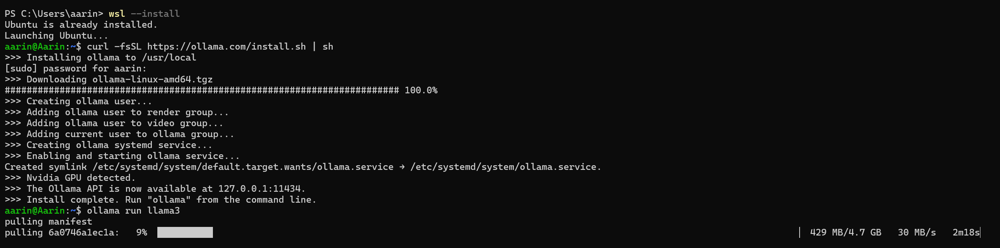
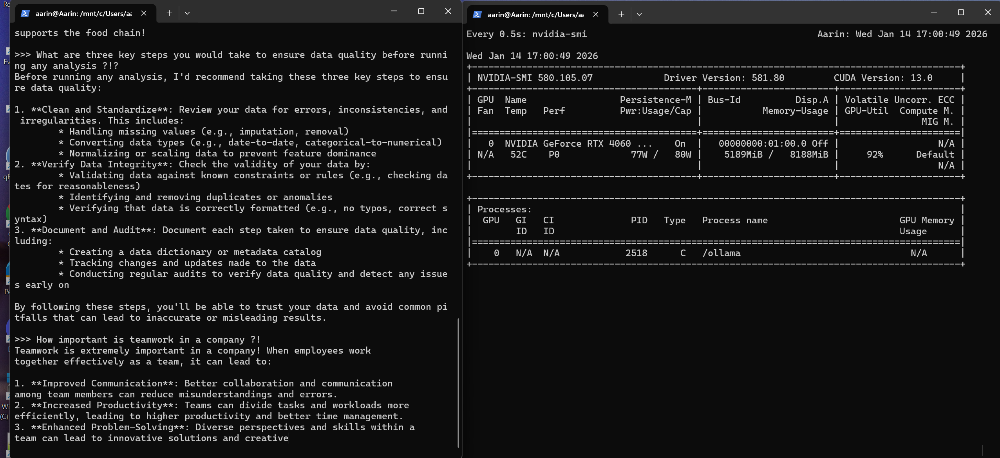
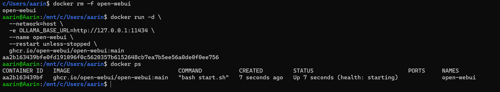
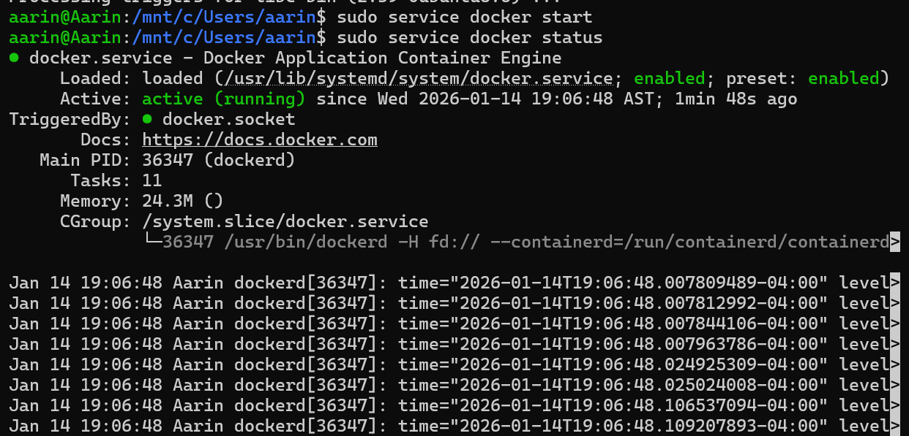
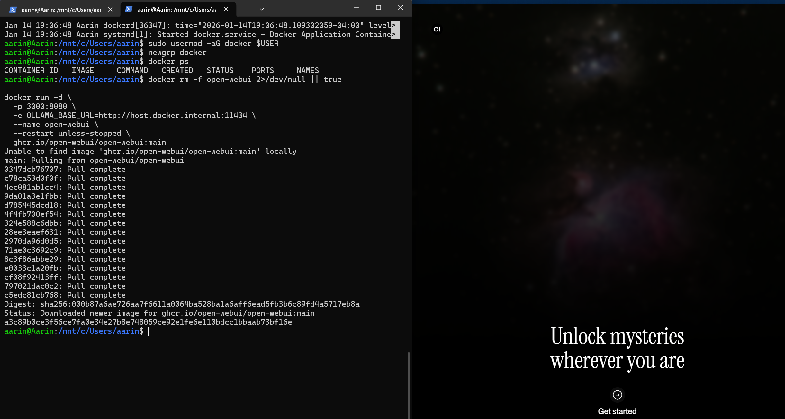
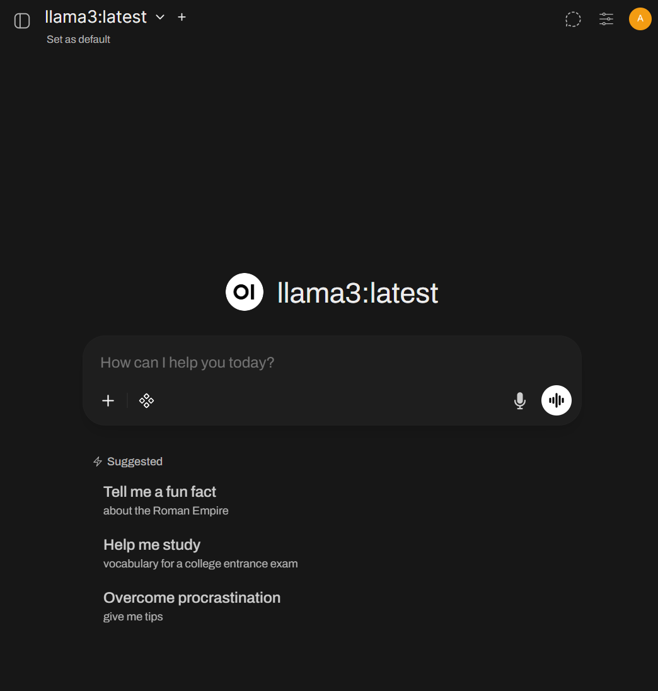

[](https://www.docker.com/)
[](https://ollama.ai/)
[](https://github.com/open-webui/open-webui)
[](https://docs.microsoft.com/en-us/windows/wsl/)
[](https://www.linux.org/)
[](https://github.com/awesome-selfhosted/awesome-selfhosted)




# Local AI Server (Ollama + Open WebUI)


A fully local AI setup running a large language model on personal hardware using Ollama and Open WebUI, without relying on cloud-based AI services.


## Project Overview

This project documents the setup of a self-hosted AI system that runs entirely on a local machine.
The goal was to run and interact with a large language model locally using a browser-based interface, while keeping all inference private and offline.

The system uses a local model server combined with a containerized web interface, allowing users to interact with the AI through a browser without relying on any external AI providers.

The goal of this project was to build a self-hosted AI system that:
- Runs entirely on a local machine
- Uses GPU acceleration when available
- Provides a modern web-based chat interface
- Supports document and PDF summarization
- Keeps inference private (no external APIs)

The system combines:
- **Ollama** as the local model server
- **Docker** to containerize the web interface
- **Open WebUI** for browser-based interaction with the model

---

## Tech Stack

- **Ollama** – Local large language model server  
- **Open WebUI** – Browser-based interface for interacting with the model  
- **Docker** – Containerized deployment of the web interface  
- **WSL2 (Ubuntu)** – Linux environment running on Windows  
- **LLaMA 3** – Local large language model
  
---

## Key Features

- Local LLM execution (no cloud dependency)
- Web-based chat interface
- PDF and document summarization
- GPU-accelerated inference
- Dockerized deployment
- Fully offline and privacy-focused

---
  
## How to Run the Project

### 1. Start the Ollama server
In a WSL terminal:
```bash
ollama serve
```

## To check if Ollama is running:

http://localhost:11434

## In a separate terminal
```bash

docker start open-webui
``` 

## In the browser

http://localhost:8080

## How to stop it 
```bash

docker stop open-webui
``` 

Stop the Ollama server by pressing **Ctrl + C** in the terminal where it is running.


## Screenshot / Guide 

The screenshots below show the full setup process and system in action, including local model execution with Ollama, Dockerized Open WebUI, GPU utilization during inference, and document summarization workflows.


WSL + ollama 



Confirms that ollama is running


AI running in Terminal + GPU usage ( Side by Side )



Open WebUI is deployed using Docker and connects to a locally running Ollama



Docker Running



Open WebUI Container



Open WebUI Admin Setup


Open WebUI chat




## Author

**Aarinnn**  
Computer Science / Data & Systems Projects  
GitHub: https://github.com/Aarinnn


